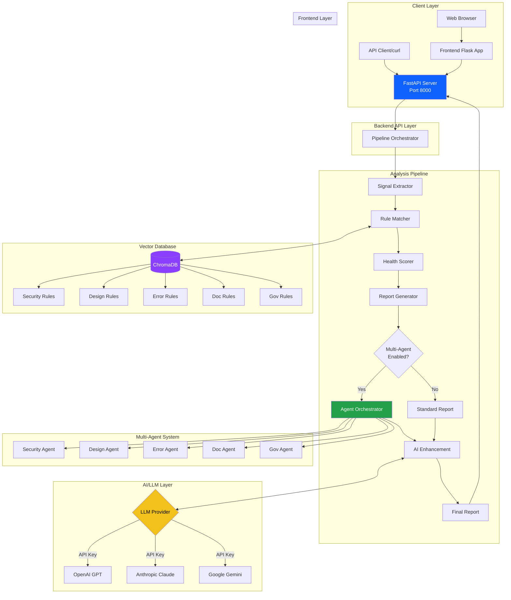
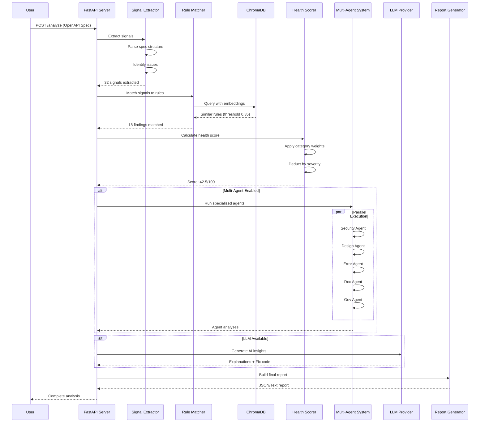
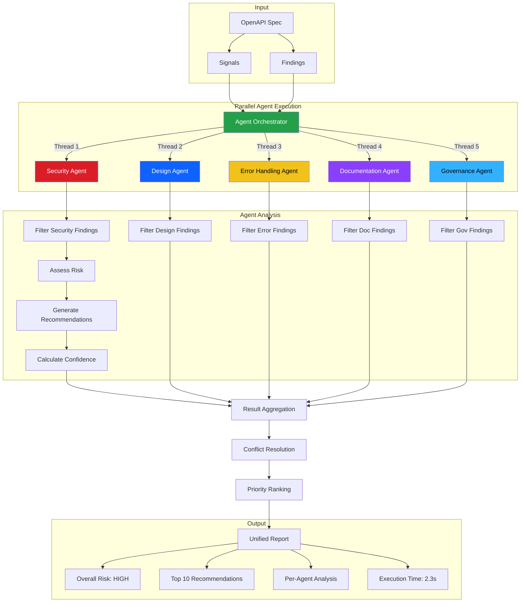
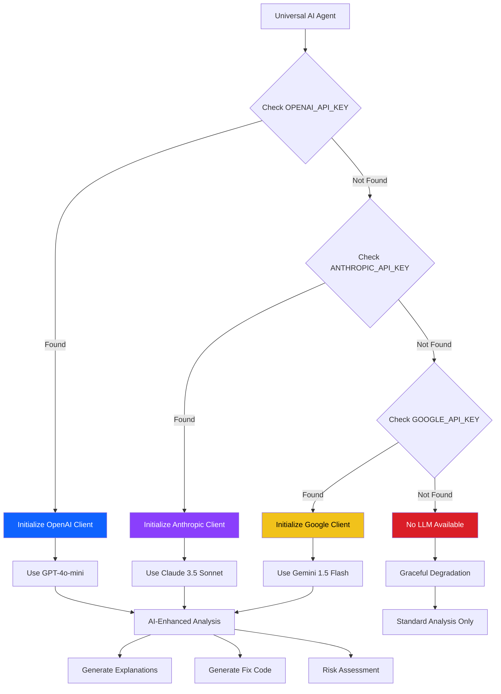
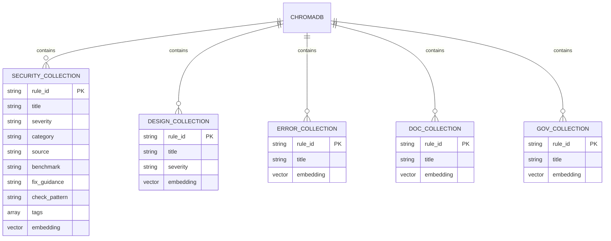
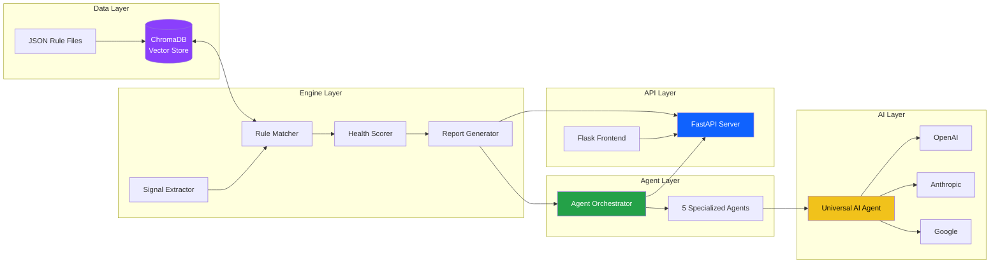
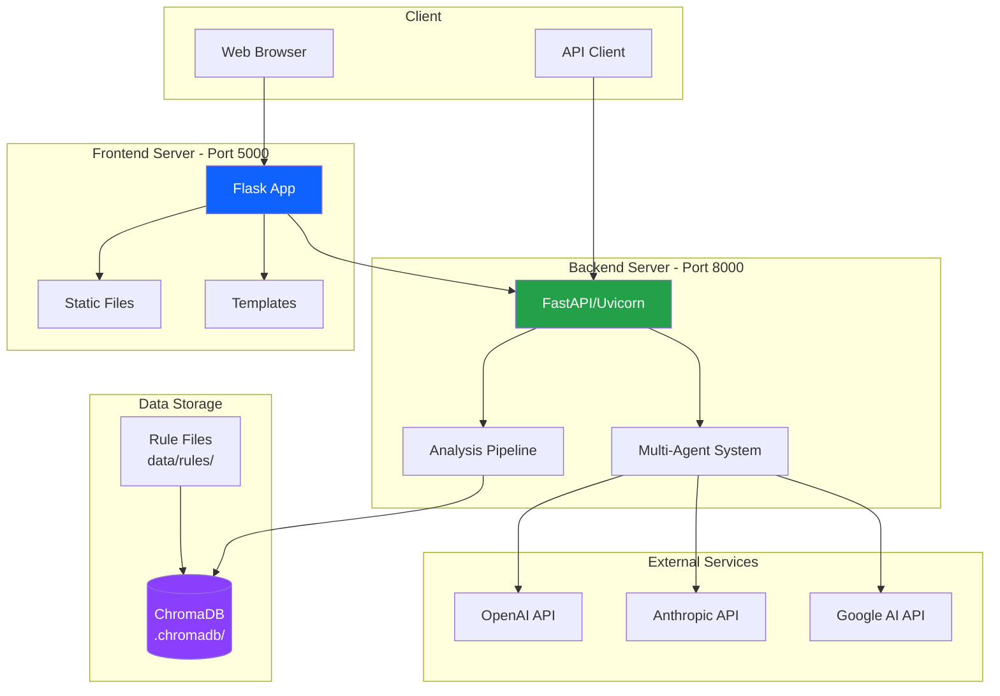

# SpecSentinel Architecture Documentation

**Version**: 1.0.0  
**Last Updated**: 2026-03-13  
**Project**: SpecSentinel - Agentic AI API Health, Compliance & Governance Bot

---

## Table of Contents

1. [Overall System Architecture](#1-overall-system-architecture)
2. [Analysis Pipeline Flow](#2-analysis-pipeline-flow)
3. [Multi-Agent System Architecture](#3-multi-agent-system-architecture)
4. [LLM Provider Selection Flow](#4-llm-provider-selection-flow)
5. [Vector Database Structure](#5-vector-database-structure)
6. [Component Interaction Diagram](#6-component-interaction-diagram)
7. [Deployment Architecture](#7-deployment-architecture)
8. [Data Flow Diagram](#8-data-flow-diagram)

---

## 1. Overall System Architecture

This diagram shows the complete system architecture including client layer, frontend, backend API, analysis pipeline, vector database, multi-agent system, and AI/LLM integration.

### Key Components

- **Client Layer**: Web browsers and API clients
- **Frontend**: Flask app serving the web UI (Port 5000)
- **Backend API**: FastAPI server handling analysis requests (Port 8000)
- **Analysis Pipeline**: Core analysis engine with 5 stages
- **Vector Database**: ChromaDB with 5 rule collections
- **Multi-Agent System**: 5 specialized agents for parallel analysis
- **AI/LLM Layer**: Support for OpenAI, Anthropic, and Google

---

## 2. Analysis Pipeline Flow

This sequence diagram illustrates the complete flow of an API specification analysis request through the system.

### Pipeline Stages

1. **Signal Extraction**: Parse OpenAPI spec and identify potential issues
2. **Rule Matching**: Use vector similarity to match signals with rules
3. **Health Scoring**: Calculate weighted score based on findings
4. **Multi-Agent Analysis** (Optional): Parallel specialized agent analysis
5. **AI Enhancement** (Optional): LLM-powered insights and recommendations
6. **Report Generation**: Create final JSON/text report

---

## 3. Multi-Agent System Architecture

This diagram shows how the multi-agent system coordinates 5 specialized agents running in parallel.

### Agent Responsibilities

| Agent | Category | Focus Areas |
|-------|----------|-------------|
| **Security Agent** | Security | Authentication, authorization, OWASP Top 10 |
| **Design Agent** | Design | RESTful principles, versioning, naming |
| **Error Handling Agent** | ErrorHandling | Status codes, RFC 7807, error schemas |
| **Documentation Agent** | Documentation | Descriptions, examples, developer experience |
| **Governance Agent** | Governance | Metadata, licensing, deprecation |

### Performance

- **Parallel Execution**: 5 agents run simultaneously using ThreadPoolExecutor
- **Speed Improvement**: 2-3x faster than sequential analysis
- **Typical Time**: 2-3 seconds for complete multi-agent analysis

---

## 4. LLM Provider Selection Flow

This flowchart shows how the Universal AI Agent automatically selects the best available LLM provider.

### Provider Priority

1. **OpenAI** (First choice if API key available)
   - Model: GPT-4o-mini (default)
   - Cost: $0.15/$0.60 per 1M tokens

2. **Anthropic** (Second choice)
   - Model: Claude 3.5 Sonnet (default)
   - Cost: $3.00/$15.00 per 1M tokens

3. **Google** (Third choice)
   - Model: Gemini 1.5 Flash (default)
   - Cost: $0.075/$0.30 per 1M tokens

4. **None** (Graceful degradation)
   - System works without AI
   - Uses rule-based analysis only

---

## 5. Vector Database Structure

This entity-relationship diagram shows the structure of ChromaDB collections and their relationships.

### Collection Details

| Collection | Rules | Source | Purpose |
|------------|-------|--------|---------|
| **security** | 10 | OWASP API Security Top 10 | Authentication, authorization, data protection |
| **design** | 8 | OpenAPI Best Practices | RESTful design, versioning, naming |
| **error_handling** | 4 | RFC 7807 | Error responses, status codes |
| **documentation** | 3 | API Documentation Standards | Descriptions, examples |
| **governance** | 4 | API Governance | Metadata, licensing, deprecation |

### Embedding Model

- **Model**: all-MiniLM-L6-v2 (Sentence Transformers)
- **Dimensions**: 384
- **Similarity Metric**: Cosine similarity
- **Threshold**: 0.35 (minimum for match)

---

## 6. Component Interaction Diagram

This diagram shows how different components interact with each other across layers.

### Layer Responsibilities

1. **Data Layer**: Persistent storage of rules and embeddings
2. **Engine Layer**: Core analysis logic and algorithms
3. **Agent Layer**: Specialized domain experts for parallel analysis
4. **AI Layer**: LLM integration for enhanced insights
5. **API Layer**: HTTP interfaces for clients

---

## 7. Deployment Architecture

This diagram shows the deployment structure with ports, services, and external dependencies.

### Deployment Configuration

| Component | Technology | Port | Purpose |
|-----------|-----------|------|---------|
| **Frontend** | Flask | 5000 | Web UI, static files |
| **Backend** | FastAPI/Uvicorn | 8000 | REST API, analysis engine |
| **Vector DB** | ChromaDB | - | Local file storage (.chromadb/) |
| **Rule Files** | JSON | - | Seed data (data/rules/) |

### External Dependencies

- **OpenAI API**: Optional, for GPT models
- **Anthropic API**: Optional, for Claude models
- **Google AI API**: Optional, for Gemini models

---

## 8. Data Flow Diagram

This flowchart shows the complete data flow from input to output.

```mermaid
flowchart LR
    A[OpenAPI Spec<br/>YAML/JSON] --> B[Parse & Validate]
    B --> C[Extract Signals<br/>32 signals]
    C --> D[Vector Embedding]
    D --> E[Semantic Search<br/>ChromaDB]
    E --> F[Match Rules<br/>threshold 0.35]
    F --> G[Filter Findings<br/>18 matches]
    G --> H[Calculate Score<br/>weighted]
    H --> I{Multi-Agent?}
    I -->|Yes| J[5 Agents Parallel]
    I -->|No| K[Standard Path]
    J --> L[Aggregate Results]
    K --> L
    L --> M{LLM Available?}
    M -->|Yes| N[AI Enhancement]
    M -->|No| O[Skip AI]
    N --> P[Final Report]
    O --> P
    P --> Q[JSON Response]
    
    style D fill:#8a3ffc,color:#fff
    style J fill:#24a148,color:#fff
    style N fill:#f1c21b,color:#000
```

### Data Transformations

1. **Input**: OpenAPI Spec (YAML/JSON) → Parsed Dict
2. **Extraction**: Spec Dict → 32 Signals (structured observations)
3. **Embedding**: Signals → 384-dim Vectors
4. **Matching**: Vectors → 18 Rule Matches (similarity > 0.35)
5. **Scoring**: Matches → Health Score (0-100)
6. **Multi-Agent**: Matches → Per-Category Analysis (parallel)
7. **AI Enhancement**: Findings → Explanations + Fix Code
8. **Output**: Aggregated Data → JSON Report

---

## Technology Stack

### Backend
- **Python 3.11+**: Core language
- **FastAPI**: Web framework
- **Uvicorn**: ASGI server
- **ChromaDB**: Vector database
- **Sentence Transformers**: Embeddings

### Frontend
- **Flask**: Web framework
- **HTML/CSS/JavaScript**: UI
- **Fetch API**: Backend communication

### AI/LLM
- **OpenAI SDK**: GPT models
- **Anthropic SDK**: Claude models
- **Google AI SDK**: Gemini models

### Multi-Agent
- **ThreadPoolExecutor**: Parallel execution
- **Concurrent.futures**: Thread management

---

## Performance Metrics

| Metric | Standard | Multi-Agent | With LLM |
|--------|----------|-------------|----------|
| **Analysis Time** | 3-5s | 2-3s | 5-8s |
| **Throughput** | 12-20/min | 20-30/min | 8-12/min |
| **Memory Usage** | 100MB | 200MB | 250MB |
| **CPU Usage** | 1 core | 5 cores | 1-5 cores |

---

## Security Considerations

1. **API Keys**: Stored in environment variables, never in code
2. **Data Privacy**: API specs sent to LLM providers (opt-in)
3. **Vector DB**: Local storage, no external transmission
4. **CORS**: Configurable, restrictive in production
5. **Input Validation**: All inputs validated before processing

---

## Scalability

### Horizontal Scaling
- Multiple backend instances behind load balancer
- Shared ChromaDB via network storage
- Stateless API design

### Vertical Scaling
- Increase worker threads for multi-agent
- Larger vector DB for more rules
- More powerful LLM models

---

## Monitoring & Observability

### Logging
- Structured logging with levels (INFO, WARNING, ERROR)
- Per-component logging (API, Engine, Agents, LLM)
- Execution time tracking

### Metrics
- Request count and latency
- Agent execution times
- LLM API usage and costs
- Vector DB query performance

---

## Future Architecture Enhancements

1. **Microservices**: Split into separate services
2. **Message Queue**: Async processing with RabbitMQ/Kafka
3. **Caching Layer**: Redis for frequent queries
4. **Database**: PostgreSQL for persistent storage
5. **Container Orchestration**: Kubernetes deployment
6. **API Gateway**: Kong or AWS API Gateway
7. **Monitoring**: Prometheus + Grafana
8. **Tracing**: OpenTelemetry integration

---

## References

- [FastAPI Documentation](https://fastapi.tiangolo.com/)
- [ChromaDB Documentation](https://docs.trychroma.com/)
- [OpenAI API Reference](https://platform.openai.com/docs/api-reference)
- [Anthropic API Reference](https://docs.anthropic.com/)
- [Google AI Documentation](https://ai.google.dev/)

---

**SpecSentinel Architecture** - Agentic AI for API Governance  
Version 1.0.0 | IBM Hackathon 2026